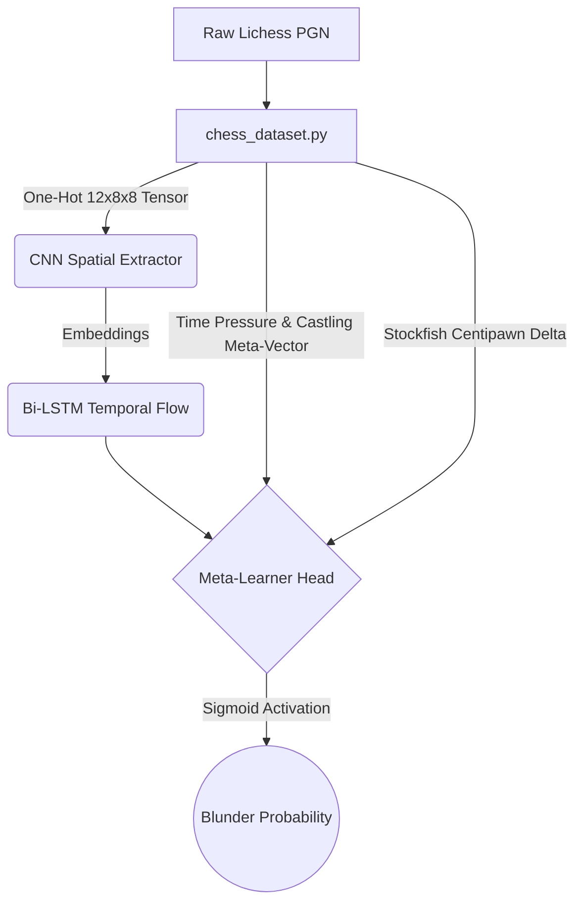

<div align="center">
  
# ♟️ Lichess Blunder Analyzer & Meta-Learner
**An AI-driven toolkit combining Stockfish engine analysis, PyTorch Deep Learning, and an interactive Streamlit Dashboard to dissect, classify, and predict human chess blunders.**

[](https://www.python.org/downloads/release/python-3110/)
[](https://pytorch.org/)
[](https://streamlit.io/)
[](https://stockfishchess.org/)

</div>
Link for Blunder analyser https://analysingmyblunders-ms2wyqsemhxgtcmkwrsxkq.streamlit.app/ !
---

## 📖 Overview

The **Lichess Blunder Analyzer** is a multi-layered analytical pipeline designed for chess players and data scientists. It doesn't just evaluate if a move was bad; it attempts to understand *why* it was bad by tracking evaluation momentum, time pressure, and tactical flow. 

It accomplishes this through three main pillars:
1. **Engine Extraction:** Pulling live games from Lichess and computing exact Centipawn Deltas using Stockfish.
2. **Spatio-Temporal Deep Learning:** A custom PyTorch CNN + Bi-LSTM architecture that processes sequences of 20 moves to capture the "tactical flow" of a game.
3. **Interactive Dashboard:** A beautiful Streamlit UI that maps game momentum and automatically tags blunder archetypes (e.g., *Hanging Piece*, *Missed Capture*).

---

## 🎨 The Streamlit Dashboard (`app.py`)

The crown jewel of this repository is the interactive Match Replay dashboard. Built on `Streamlit` and `chess.svg`, it provides a Lichess-grade review experience.

### ✨ Features
- **Plotly Momentum Charts:** A dynamic line graph tracking White's evaluation advantage over the course of the match, complete with an interactive tracking line synced to your position.
- **SVG Blunder Overlays:** Visual heatmaps and arrows drawn directly onto the chess board.
  - 🔴 **Red Arrow:** The blunder you played.
  - 🟢 **Green Arrow:** The optimal engine recommendation.
  - 🟥 **Red Highlight:** The square where you dropped a piece or allowed an attack.
- **Contextual Diagnostics:** Analyzes the PGN `[%clk]` tags to determine if you blundered under **Heavy Time Pressure**.
- **Instant Blunder Navigation:** No more scrolling blindly. A sidebar timeline automatically generates a list of your worst mistakes so you can jump to them in a single click.

---

## 🧠 The Deep Learning Pipeline

This repository includes a sophisticated neural network designed to act as a **Meta-Learner** on top of traditional engines.



### Components
* **`chess_dataset.py`**: Converts traditional Python-chess boards into multi-dimensional tensors. Pieces are mapped across 12 channels (6 pieces $\times$ 2 colors), while external meta-features like Clock Time and Castling rights are extracted.
* **`model.py`**: A hybrid architecture. A 2D-Convolutional Neural Network processes the physical board state, before feeding the spatial embeddings into a Bidirectional LSTM to track momentum across a 20-ply window.
* **`trainer.py`**: The training loop utilizing `BCELoss`, Adam Optimization, and automated early stopping to train the Meta-Learner head.

---

## 🚀 Getting Started

### Prerequisites
1. **Python 3.11+**
2. **Stockfish Engine:** Download the binary from [Stockfish's official site](https://stockfishchess.org/download/) and ensure it is accessible in your system `PATH`.
3. Install dependencies:
   ```bash
   pip install torch python-chess berserk streamlit pandas plotly
   ```

### Running the Project

**1. Fetch Games:**  
Edit `lichess_parser.py` with your username and run it to pull your latest games into a `.pgn` file.
```bash
python lichess_parser.py
```

**2. Test the Engine Bridge:**  
Verify Stockfish is correctly hooked up and computing Centipawn deltas.
```bash
python stockfish_bridge.py
```

**3. Launch the Dashboard:**  
Open the beautiful UI in your web browser.
```bash
streamlit run app.py
```

---

## 🛠️ Advanced: Hacking Stockfish (`stockfish_cpp_modification.md`)

If you want to take your dataset to the next level, check out the included `stockfish_cpp_modification.md` guide. It provides C++ instructions for hacking Stockfish's core `search.cpp` Iterative Deepening loop. 

By intercepting the evaluation scores *at every progressive depth*, you can extract the engine's "volatility trajectory"—an incredibly powerful feature for the Meta-Learner to detect chaotic, highly tactical positions!
